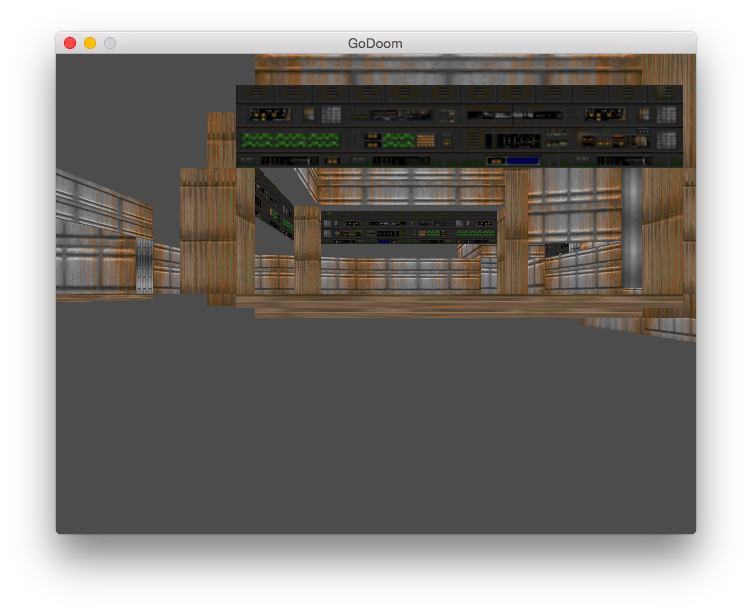

# GoDoom

GoDoom is a Doom rendered written from scratch in the Go programming language using OpenGL for rendering.



## Installation

Prerequisites:

* Go
* [GLFW3](https://github.com/go-gl/glfw3)
* OpenGL 3.3 capable GPU

OS X:

``` sh
brew tap homebrew/versions
brew install --build-bottle --static glfw3
go get github.com/go-gl/glfw3
brew install glew
go get github.com/go-gl/gl
```

Installation:

``` sh
go get github.com/penberg/godoom
```

## Usage

You need a Doom WAD file that contains all the game assets. If you don't have a
copy of the game, you can use data file from the [shareware version](http://distro.ibiblio.org/pub/linux/distributions/slitaz/sources/packages/d/doom1.wad).

To run GoDoom, type:

``` sh
godoom -f <wad-file>
```

## Licence

GoDoom is distributed under the 2-clause BSD license.

## References

* [The Unofficial Doom Spec](http://www.gamers.org/dhs/helpdocs/dmsp1666.html)
* [Doom Wiki](http://doomwiki.org/)
